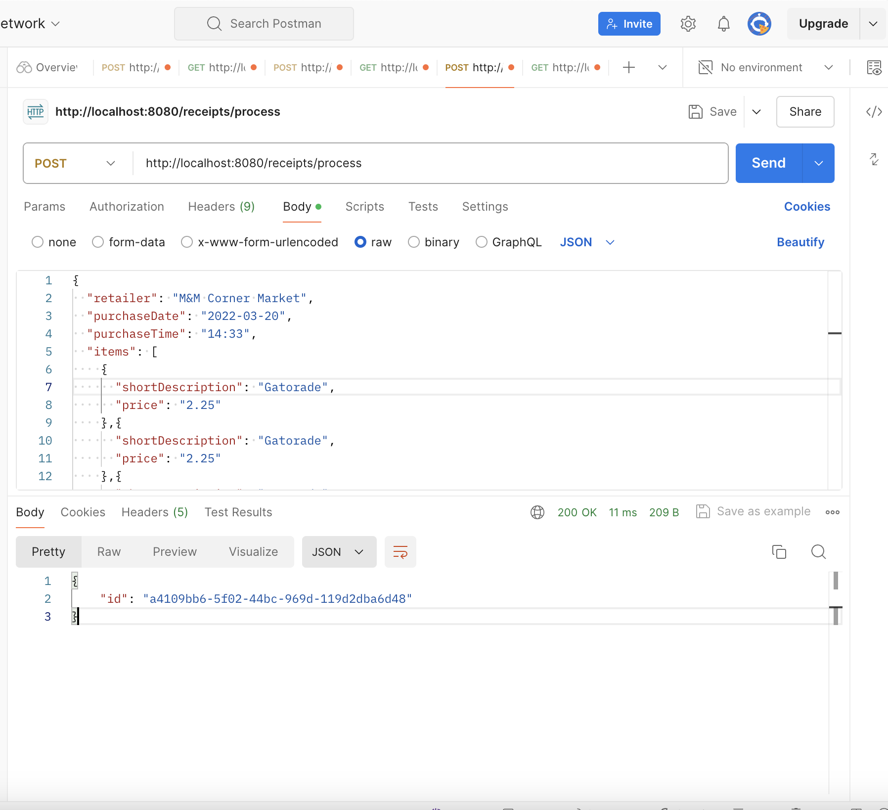
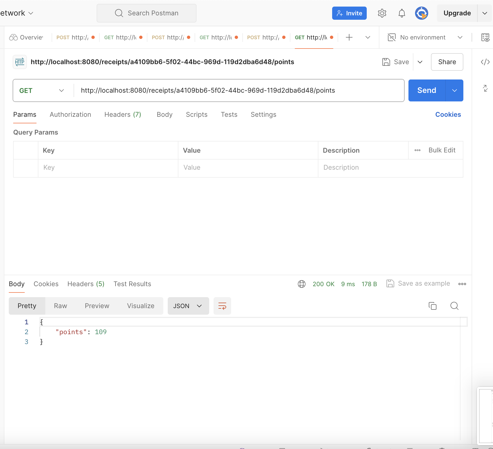
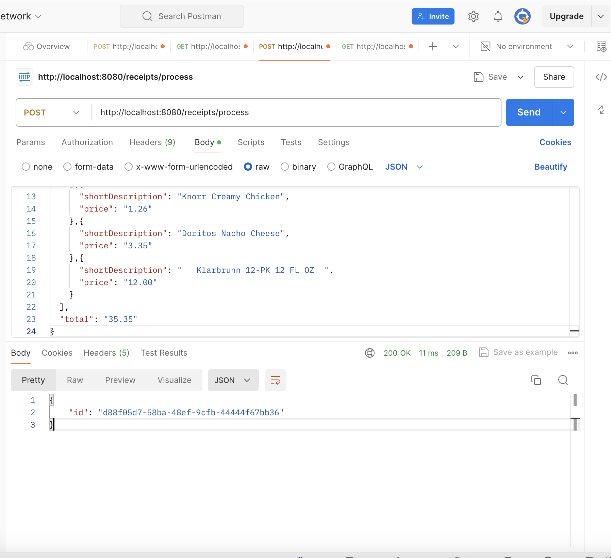
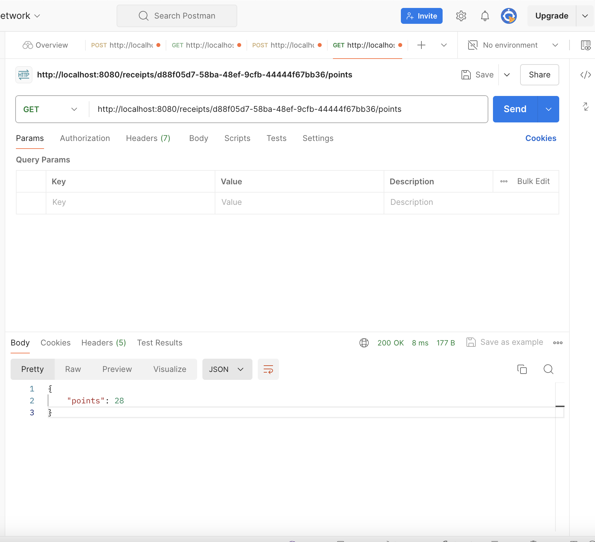
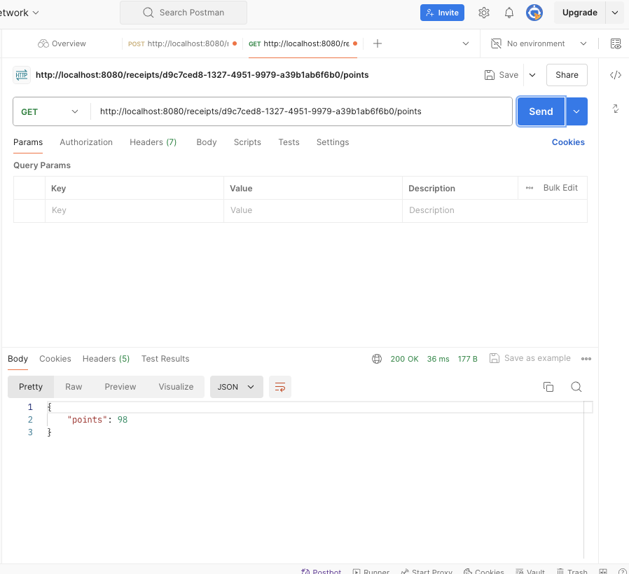

# Fetch-Receiptprocessor-Challenge
 
## Overview
The Receipt Processor Service is a Spring Boot application designed to process receipts and calculate reward points based on specific rules. It exposes RESTful endpoints to make receipt processing straightforward, and it's easy to integrate into existing systems that need a reliable point calculation mechanism based on receipts.

## Features
- **Process Receipts**: Submit receipt details to generate a unique receipt ID and calculate points according to the defined rules.
- **Retrieve Points**: Retrieve reward points for a previously processed receipt using its receipt ID.
- **Docker Support**: The application can be containerized using Docker, making it easy to deploy and scale.
- **REST API**: Provides two endpoints for handling receipt processing and point retrieval.

## Endpoints
### 1. Process Receipt
- **URL**: `/receipts/process`
- **Method**: `POST`
- **Description**: Accepts receipt details, processes them, and returns a unique receipt ID.
- **Request Body** (JSON):
  ```json
  {
    "retailer": "Target",
    "purchaseDate": "2023-10-10",
    "purchaseTime": "15:00",
    "total": "20.00",
    "items": [
      {"shortDescription": "Mountain Dew", "price": "6.49"},
      {"shortDescription": "Doritos", "price": "3.50"}
    ]
  }
  ```
- **Response** (JSON):
  ```json
  {
    "id": "<unique-receipt-id>"
  }
  ```

## Technologies Used
- **Java 17**: Main programming language for the service.
- **Spring Boot**: Framework used to create RESTful APIs.
- **Maven**: Build and dependency management tool.
- **Docker**: Containerization to simplify deployment.
- **JUnit 5**: For unit testing the application.

## Prerequisites
- **Java 17**: Ensure Java 17 is installed and configured.
- **Maven**: Used for building the project.
- **Docker** (Optional): For running the service in a containerized environment.


### Example with Postman
- **Process a Receipt**:
  - Open Postman and create a new `POST` request to `http://localhost:8080/receipts/process`.
  - In the **Body** section, select **raw** and set the format to **JSON**.
  - Use the following JSON:
    ```json
    {
      "retailer": "Target",
      "purchaseDate": "2023-10-10",
      "purchaseTime": "15:00",
      "total": "20.00",
      "items": [
        {"shortDescription": "Mountain Dew", "price": "6.49"},
        {"shortDescription": "Doritos", "price": "3.50"}
      ]
    }
    ```
  - Send the request. You will receive a unique receipt ID in the response.

- **Get Points for a Receipt**:
  - Create a new `GET` request to `http://localhost:8080/receipts/{id}/points`, replacing `{id}` with the actual receipt ID from the previous response.
  - Send the request and you'll get the points for that receipt.


  ### Images of the results generated using Postman

 - **Test 1**

  

  - *Figure 1: This image shows the receipt being processed in Postman, and a unique receipt ID is generated in the response.*
  
  
  -*Figure 2: This image shows the points being retrieved for the given receipt ID.*

 - **Test 2**

  
  - *Figure 3: This image shows the receipt being processed in Postman, and a unique receipt ID is generated in the response.*
  
  
  -*Figure 4: This image shows the points being retrieved for the given receipt ID.*
  
- **This result was generated by using the sample input given in the challenge**

  
  -*Figure 5: This image shows the points being retrieved for the given receipt ID.*
